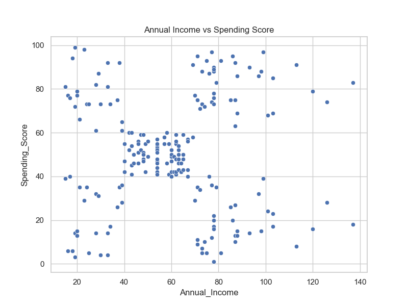
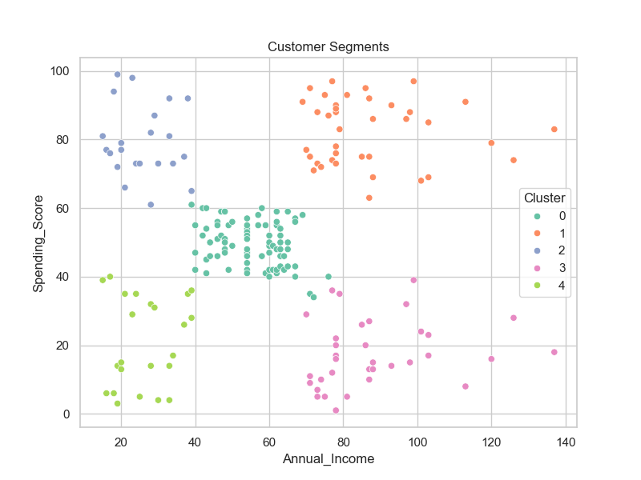

## Project Preview

Customer segmentation visualization:

# Customer Segmentation Analysis using Machine Learning

## Project Overview

Customer segmentation is a marketing strategy used to divide customers into groups based on shared characteristics. Businesses use segmentation to better understand their customers and create targeted marketing strategies.

In this project, we analyze mall customer data to understand customer demographics and spending behavior. Using exploratory data analysis and machine learning techniques, we identify distinct customer segments based on income and spending patterns.

The goal of this project is to demonstrate how data analysis and clustering techniques can help businesses make better strategic decisions.

---

## Dataset

The dataset contains information about mall customers.

Features include:

- CustomerID
- Gender
- Age
- Annual Income (k$)
- Spending Score (1–100)

Spending score is assigned based on customer purchasing behavior and spending patterns.

---

## Project Structure
customer-segmentation-analysis

data/
Mall_Customers.csv

notebooks/
customer_segmentation_analysis.ipynb

visuals/
age_distribution.png
income_distribution.png
spending_distribution.png
income_vs_spending.png
customer_segments.png

README.md
requirements.txt

---

## Tools and Technologies

Python  
Pandas  
NumPy  
Matplotlib  
Seaborn  
Scikit-learn  
Jupyter Notebook

---

## Exploratory Data Analysis

The project begins with an exploration of customer demographics including:

- Age distribution
- Gender distribution
- Annual income distribution
- Spending score distribution

These analyses help reveal general patterns in the customer population.

---

## Customer Segmentation (Machine Learning)

To identify distinct customer groups, the **K-Means clustering algorithm** was applied using the following features:

- Annual Income
- Spending Score

The **Elbow Method** was used to determine the optimal number of clusters.

This resulted in **five customer segments** representing different spending behaviors.

---

## Key Insights

1. Most customers fall within the **20–40 age group**, indicating younger individuals dominate the mall’s customer base.

2. Customer income varies widely, suggesting the mall attracts both moderate-income and high-income shoppers.

3. Several distinct customer segments appear when analyzing income and spending behavior.

4. High-income high-spending customers represent the most valuable customer group.

5. High-income low-spending customers represent a key opportunity for targeted marketing campaigns.

---

## Business Recommendations

Based on the analysis, businesses could adopt the following strategies:

- Target **high-income high-spending customers** with loyalty programs and exclusive offers.

- Develop marketing campaigns aimed at **high-income low-spending customers** to increase engagement.

- Provide promotions and discounts to encourage spending among moderate-income segments.

---

## Visualization Example

Customer segmentation based on income and spending behavior:

---

## Conclusion

This project demonstrates how data analysis and machine learning techniques can help businesses better understand customer behavior and develop targeted marketing strategies.

Customer segmentation allows businesses to focus their marketing efforts more effectively and improve overall customer engagement.

---
## Skills Demonstrated

- Data Cleaning
- Exploratory Data Analysis
- Data Visualization
- Customer Segmentation
- K-Means Clustering
- Business Insight Generation

## Author

Rohan  
Aspiring Data Analyst
